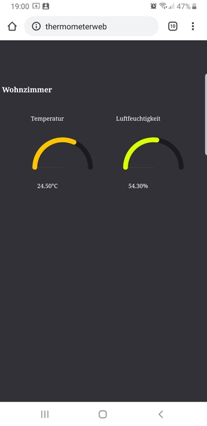

# NodeMCU Temperature Sensor with DHT22

  
Creates a simple asynchronous webserver on a NodeMCU to show up temperature an humidity. As sensor DHT22 is used. Before installing code on NodeMCU make sure to upload files from data folder and replace placeholder for **HOSTNAME**, **WLAN_SSID** and **WIFI_SECURE_KEY**

### Api
`http://<hostname>/` Returns the file *./WebServer/data/index.html*, replacing placeholder for temperature and humidity with actually read values from sensor.

`http://<hostname>/temp` Returns the temperature in °C as a string, e.g. `20.1`.

`http://<hostname>/humidity` Returns the humidity in percent as a string, e.g. `50.3`.

`http://<hostname>/json` Returns hostname, temperature and humidity as json as a single line.  
    ```
    {
        "hostname":"Wohnzimmer",
        "temperature":22.5,
        "humidity":40.2
    }
    ```

## Install Arduino IDE and Libraries

1. [Install SPIFFS](https://randomnerdtutorials.com/install-esp8266-filesystem-uploader-arduino-ide/)
2. Adafruit ESP8266 by Adafruit
3. [DHT Sensor Libraries by Adafruit](https://github.com/adafruit/DHT-sensor-library)
4. [ESPAsyncWebServer](https://github.com/me-no-dev/ESPAsyncWebServer)*
5. [ESPAsyncTCP](https://github.com/me-no-dev/ESPAsyncTCP)* 
6. [ArduinoJson by bblanchon](https://github.com/bblanchon/ArduinoJson)

*Download the last release zip and install manually.

## Used libs

[JQuery Simple Gauge JS](https://www.jqueryscript.net/chart-graph/progress-gauge-simplegauge.html)
